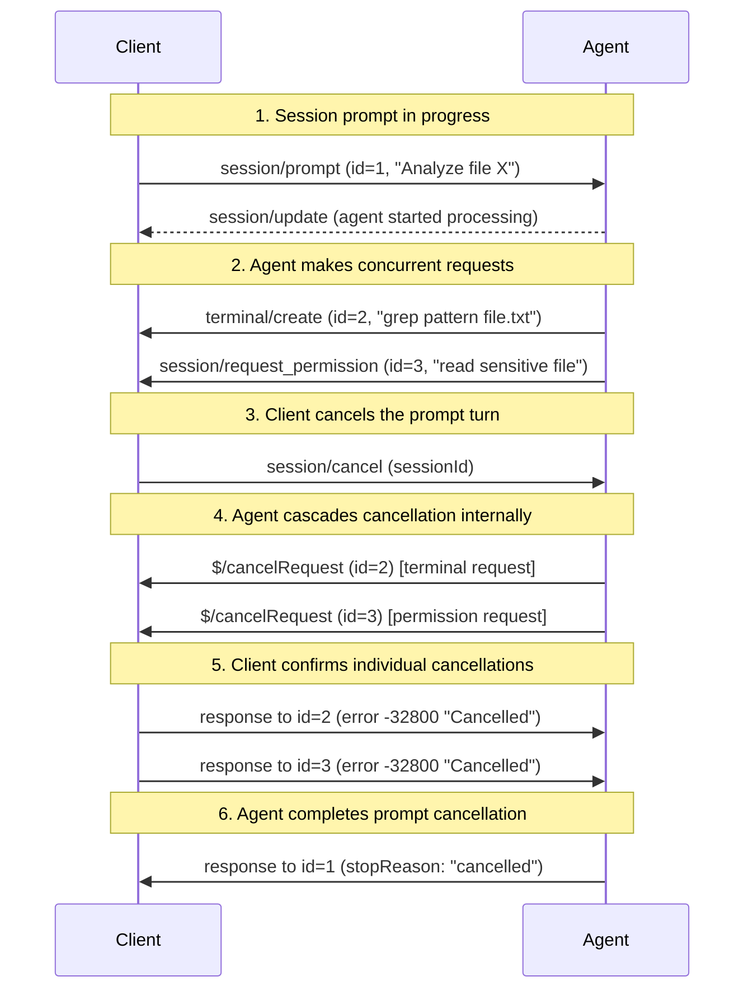

- Author(s): [Artem Bukhonov](https://github.com/nerzhulart)
- Champion: [@benbrandt](https://github.com/benbrandt)

## Elevator pitch

Introduce a standardized per-request cancellation mechanism for the Agent Client Protocol, inspired by the [Language Server Protocol (LSP)](https://microsoft.github.io/language-server-protocol/specifications/lsp/3.17/specification/#cancelRequest), to enable a more granular cancellation of requests where individual JSON-RPC requests can be cancelled one by one.

## Status quo

The JSON-RPC specification doesn't define any standard mechanism for request cancellation and leaves it up to the implementation. Currently, ACP has some ad-hoc cancellation mechanisms for specific features (like prompt turn cancellation via `session/cancel`), but lacks a general-purpose, per-request cancellation mechanism.

This creates the following inconveniences:

- cancellation should be handled for each feature separately
- some languages that support handy cancellation mechanisms (C#, Kotlin, etc.) can't implement general-purpose request cancellation using ACP low-level machinery, and rather developers should manually call per-feature cancellation methods

## What we propose to do about it

Implement an **optional** `$/cancelRequest` notification method (inspired by the Language Server Protocol) that uses JSON-RPC 2.0 notification format, allowing either party (client or agent) to cancel any outstanding request by its ID.

The mechanism will be:

- **Optional**: Declared through capabilities exchange during initialization
- **Unavailable** for `initialize` request (which happens before capabilities exchange)
- **Flexible**: Provides two response options when cancellation is received:
  1. An error response with the standard cancellation error code (-32800)
  2. A valid response with partial or cancelled data (when meaningful partial results exist)

This approach balances flexibility with standardization, allowing implementations to opt-in to cancellation support while providing predictable behavior when enabled.

## Shiny future

Once implemented, this enables:

- **SDK integration layer**: Default mechanism that ACP SDKs can automatically wire to native language cancellation (C# CancellationToken, Kotlin Job, Go context.Context, JavaScript AbortController, etc.)
- Individual JSON-RPC request cancellation without affecting other concurrent requests
- Universal fallback for any request when feature-specific cancellation methods don't exist
- Consistent cancellation behavior from both external `$/cancelRequest` and internal cancellation triggers
- Standard error response (`-32800`) or partial results when requests are cancelled regardless of cancellation source

The mechanism complements existing `session/cancel` for prompt turns while providing granular per-request control.

## Implementation details and plan

### Protocol Changes

#### Capability Declaration

Cancellation support must be declared during the capabilities exchange. Add new optional capability fields:

```typescript
interface CancellationCapabilities {
  request?: boolean; // Default: false
}

interface ClientCapabilities {
  // existing capabilities...
  cancellation?: CancellationCapabilities;
}

interface AgentCapabilities {
  // existing capabilities...
  cancellation?: CancellationCapabilities;
}
```

#### Cancellation Method

Add the `$/cancelRequest` notification method to the JSON-RPC protocol:

```typescript
interface CancelNotification {
  method: "$/cancelRequest";
  params: {
    id: string | number; // ID of request to cancel
  };
}
```

### Cancellation Behavior

#### Prerequisites

- A party **MUST** declare `{ cancellation: { request: true } }` in their capabilities to handle `$/cancelRequest` notifications for their requests
- The other party can send `$/cancelRequest` to cancel requests if the recipient declared support
- Until capabilities are exchanged, **NO** requests can be cancelled
- The `initialize` request **CANNOT** be cancelled as it occurs before capability exchange
- Any requests after `initialize` (which performs capability negotiation) **CAN** be cancelled if the recipient declared support

#### Responsibility for Support Checking

The **calling party** (sender of `$/cancelRequest`) **MUST**:

- Check the recipient's capabilities before sending `$/cancelRequest`
- Only send `$/cancelRequest` if the recipient declared `supportsRequestCancellation: true`
- Not send `$/cancelRequest` notifications to parties that don't support them

The **receiving party** is **NOT** required to:

- Perform special handling for unsupported cancellation requests
- Return custom errors for unsupported `$/cancelRequest` notifications

#### Cancellation Processing

When a `$/cancelRequest` notification is received by a supporting implementation:

1. **MUST** cancel the corresponding request activity and all nested activities
2. **MUST** send one of these responses for the original request:
   - Error response with code `-32800` (Cancelled)
   - Valid response with appropriate data (partial results or cancellation marker)

#### Internal Cancellation

Requests can also be cancelled internally by the executing party without receiving `$/cancelRequest`:

- **Client-side examples**: User closes IDE, switches to different project, file becomes unavailable
- **Agent-side examples**: LLM context limit reached, internal timeout, resource constraints

When internal cancellation occurs, the executing party **SHOULD**:

1. Stop the request processing immediately
2. Send the same `-32800` (Cancelled) error response as if `$/cancelRequest` was received
3. Ensure consistent behavior regardless of cancellation source

### Error Code

Add standard JSON-RPC error code `-32800` for cancelled requests:

- Code: `-32800`
- Message: "Cancelled"
- Meaning: The request was cancelled

## Frequently asked questions

### What alternative approaches did you consider, and why did you settle on this one?

The core need is to add **granular cancellation** as a general mechanism for individual JSON-RPC requests, while **feature-specific cancellation methods** (like `session/cancel`) remain useful for cases requiring additional domain semantics.

We selected the **LSP-style `$/cancelRequest`** approach because:

- Serves as a **default cancellation layer** that SDK implementations can easily map to native language cancellation mechanisms
- Proven pattern familiar to developers from LSP ecosystem
- Works across all JSON-RPC transports (HTTP, WebSocket, stdio, pipes)
- Provides universal fallback when feature-specific cancellation doesn't exist
- Complements existing feature-specific methods rather than replacing them

### How does this relate to existing cancellation mechanisms like `session/cancel`?

The `$/cancelRequest` mechanism is complementary to feature-specific cancellation:

- `$/cancelRequest`: Generic cancellation for any JSON-RPC request by ID
- `session/cancel`: Feature-specific cancellation with additional semantics (e.g., cancels entire prompt turn context, triggers specific cleanup logic)

Both mechanisms serve different purposes:

**Feature-specific methods** like `session/cancel` provide:

- Domain-specific semantics and behavior
- Structured cleanup for complex operations
- Context-aware cancellation logic

**Generic `$/cancelRequest`** provides:

- Default cancellation layer that bridges programming language cancellation mechanisms (C# CancellationToken, Kotlin Job, Go context.Context, etc.) with ACP
- Universal fallback for any request when no feature-specific method exists
- Simple ID-based targeting for SDK convenience
- Standardized error responses

Implementations can use both: feature-specific methods for rich semantics, and `$/cancelRequest` for simple per-request cancellation.

Note: it is possible that `session/cancel` could be replaced by the more generic `$/cancelRequest` in future versions of the protocol.

#### Example: Cascading Cancellation Flow



### What happens if a request completes before the cancellation is processed?

If a request completes normally before the cancellation notification is processed, the implementation should:

1. Send the normal response (not a cancellation error)
2. Ignore the subsequent cancellation notification for that request ID

This ensures clients always receive meaningful responses and prevents race conditions.

### How should implementations handle cascading cancellation?

When a request is cancelled, implementations should:

1. Cancel the primary request activity
2. Propagate cancellation to any nested/child requests
3. Clean up resources associated with the entire request tree
4. Send cancellation responses for all affected requests

This ensures complete cleanup and prevents resource leaks.

### Is cancellation mandatory or optional?

Cancellation support is **optional** in the current protocol version and declared through capabilities:

- Implementations **MAY** support handling cancellation by declaring `supportsRequestCancellation: true`
- If an implementation declares support, it **MUST** handle `$/cancelRequest` notifications for its requests
- If an implementation does not declare support, `$/cancelRequest` notifications should be ignored
- The other party can send `$/cancelRequest` regardless of their own declared support
- The `initialize` request **CANNOT** be cancelled regardless of capability support
- Any requests after `initialize` **CAN** be cancelled if the recipient declared support

When cancellation is supported:

- Implementations **MUST** respond with either an error or valid response
- Implementations **MAY** choose how quickly to honor cancellation requests
- Implementations **MAY** return partial results instead of errors when appropriate

**Future consideration**: There is a proposal to make basic `$/cancelRequest` support **mandatory** in the next major protocol version to ensure consistent cancellation behavior across all ACP implementations and improve SDK developer experience.

### Example scenarios:

1. **Client-to-Agent cancellation only**: Client declares support=false, Agent declares support=true
   - Client can send `$/cancelRequest` to cancel agent's requests
   - Agent cannot send `$/cancelRequest` to client (client will ignore)

2. **Bidirectional cancellation**: Both declare support=true
   - Both parties can cancel each other's requests

3. **No cancellation**: Both declare support=false (or omit the capability)
   - No `$/cancelRequest` notifications are processed

## Revision history

- 2025-11-13: Initial version converted from PR #183
