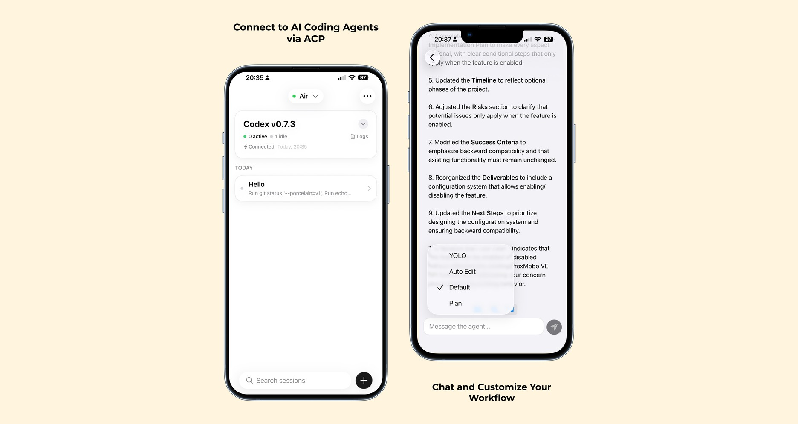

# Agmente

Agmente is an iOS client for coding agents. It connects to servers that speak ACP (Agent Client Protocol) or the Codex app-server protocol and shows tool calls, results, and conversation history on device.



**Download**
- [Agmente on the App Store](https://apps.apple.com/us/app/agmente/id6756249477)

**Key capabilities**
- Connect to ACP agents (Copilot CLI, Gemini CLI, Claude Code adapters, Qwen, Mistral Vibe, and others)
- Connect to Codex app-server endpoints
- View tool calls and results in the transcript
- Optional Cloudflare Tunnel + Access credentials for remote access

**Remote agents**
- Start an ACP or Codex app-server agent on a remote host and expose it over `wss://`.
- Use bearer tokens and/or Cloudflare Access service tokens when the endpoint is protected.
- Full setup: `setup.md` (local: `Agents.md`)

**Quick start: remote ACP agent with stdio-to-ws**
- Run these on your remote host (start/stop as separate commands):
```bash
npx -y @rebornix/stdio-to-ws --persist --grace-period 604800 "copilot --acp" --port 8765
```
```bash
pkill -9 -f "stdio-to-ws.*8765"
```
- Expose the port behind TLS and connect from Agmente using `wss://<your-host>` (see `docs/remote-agent.md`).

## Repository layout
- `Agmente/` iOS app source
- `ACPClient/` Swift package used by the app
- `AppServerClient/` Codex app-server client support

## Requirements
- Xcode (latest stable recommended)
- macOS for iOS builds

## Build (iOS)
Open `Agmente.xcodeproj` in Xcode and run the `Agmente` scheme on a simulator or device.

CLI build example:
```bash
xcodebuild -project Agmente.xcodeproj -scheme Agmente -destination 'platform=iOS Simulator,name=iPhone 16'
```

## Tests
App tests:
```bash
xcodebuild -project Agmente.xcodeproj \
  -scheme Agmente \
  -destination "platform=iOS Simulator,id=<SIMULATOR_UDID>" \
  test
```

ACPClient package tests:
```bash
swift test --package-path ACPClient
```

## License
MIT. See `LICENSE`.
